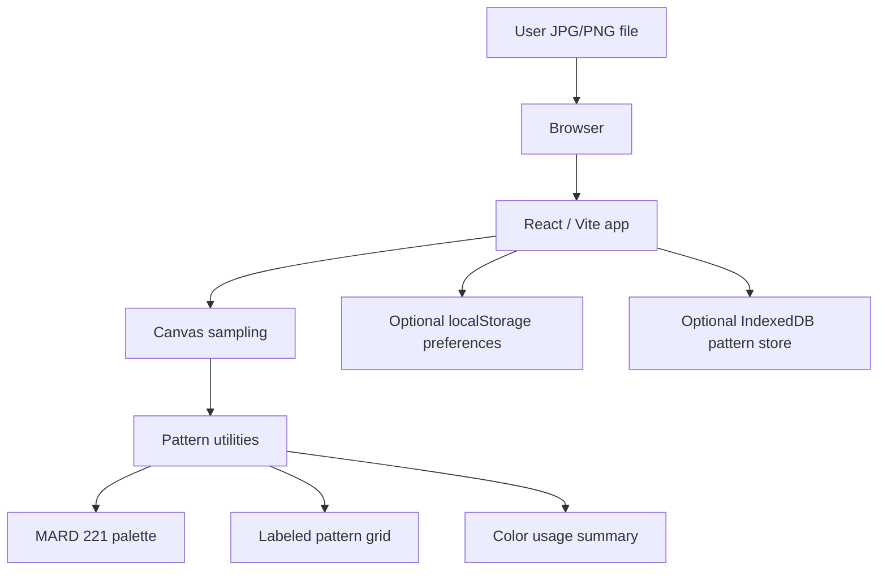

# Fundbeads Architecture

Fundbeads is a single-page, client-only web application. It converts a user-selected JPG or PNG into a Perler Bead / Fuse Bead pattern inside the browser.

## Runtime Boundary



There is no backend service. The production Docker image serves static files with nginx.

## Current Stack

- Vite
- React
- TypeScript
- Tailwind CSS v4
- pnpm workspace
- `@google/design.md` for linting and generating design theme variables
- nginx for static Docker runtime

## Source-of-Truth Map

- `frontend/src/App.tsx`: Single-page workflow, upload controls, longest-edge pattern controls, grid rendering, and summary rendering.
- `frontend/src/i18n.tsx`: Locale allowlist, static translation dictionaries, interface style labels, optional palette label overrides, and i18n provider.
- `frontend/src/themes.tsx`: Theme allowlist, static theme ids, and theme preference provider.
- `frontend/src/interface-style.tsx`: Interface style allowlist, static style ids, and interface style preference provider.
- `frontend/src/browser-storage.ts`: Safe optional access to browser `localStorage`.
- `frontend/src/local-pattern-db.ts`: Browser-local IndexedDB infrastructure for compact, validated pattern records.
- `frontend/src/pattern.ts`: `PatternDimensions`, aspect-ratio dimension derivation, `Pattern`, `PatternCell`, `ColorUsage`, image sampling, RGB matching, readable text color, and count summaries.
- `frontend/src/palette.ts`: Stable exports for the active MARD palette contract.
- `frontend/src/palettes/mard.ts`: Built-in static MARD 221 palette definition.
- `frontend/src/styles.css`: Tailwind v4 semantic token mapping and named runtime theme overrides.
- `frontend/src/design-theme.generated.css`: Generated CSS variables from `DESIGN.md`. Do not edit directly.
- `scripts/generate-design-theme.mjs`: Design token generation script.
- `docs/pattern-processing.md`: Pattern-processing contract.
- `docs/design-rules.md`: UI and grid design contract.
- `docs/runtime-and-deployment.md`: Build and static deployment contract.

## Data Flow

1. The browser receives a local `File` from the file input.
2. `createImageBitmap` decodes the image in the browser.
3. The app derives pattern dimensions from the decoded image aspect ratio and selected longest edge.
4. A canvas draws the full image at the derived pattern dimensions without cropping.
5. Pixel data is read from the canvas.
6. Transparent pixels are composited against white.
7. Each sampled RGB value is matched to the nearest MARD 221 palette entry by squared RGB Euclidean distance.
8. Pattern cells are produced in row-major order with 1-based `x` and `y` coordinates.
9. Usage counts are derived from the generated cells.
10. React renders the grid and summary.

Language, theme, and interface style preferences are independent of pattern processing. They are read from browser `localStorage` when available, validated against source-defined allowlists, and ignored if storage is blocked or contains unsupported values.

The local pattern persistence module is also independent of pattern generation. It stores compact pattern records in browser IndexedDB only when explicitly called by current or future UI flows. It stores row-major MARD codes and usage counts, not DOM snapshots, per-cell RGB copies, object URLs, account authority, or automatically persisted source images.

## Contracts

- Supported pattern dimensions are derived from the source image aspect ratio and selected longest edge.
- Supported longest-edge presets are `52`, `64`, and `78`; the longest edge can be adjusted from `40` to `100`.
- `BeadColor.code` is the stable color identity.
- `BeadColor.label` is display copy.
- Palette label overrides are display-only and keyed by `BeadColor.code`; stable fallback labels use `MARD {code}`.
- `PatternCell.x` and `PatternCell.y` are 1-based.
- `Pattern.totalBeads` equals `Pattern.cells.length`.
- For complete generated patterns, `Pattern.totalBeads` equals `width * height`.
- `ColorUsage.count` is derived from pattern cells, never from formatted UI text.
- Supported locales are `en`, `zh-Hans`, `zh-Hant`, `ja`, `ko`, and `es`.
- Supported theme ids are `classic`, `midnight`, `ocean`, `candy`, and `mono`.
- Supported interface style ids are `modern` and `pixel`.
- Local pattern records use the `fundbeads-pattern-store` IndexedDB name and versioned compact records.
- Persisted pattern records carry `width`, `height`, `paletteSlug`, `paletteVersion`, row-major `cellCodes`, `usage`, `totalBeads`, and `usedColorCount`.
- Persisted pattern records must validate against the active `mard-221` palette before they are reconstructed into `Pattern`.

## Boundaries

- Uploaded images must not leave the browser.
- Themes, interface styles, translations, and palette data are bundled static source data.
- The app must not add a backend, server-side database, image upload service, or remote image processor without an explicit product decision.
- IndexedDB is browser-local UX/cache infrastructure. It is not account authority and does not imply server sync.
- Source image blobs are not automatically stored. Any future source image persistence must be explicit and bounded.
- The app must not load remote translations, remote themes, telemetry, or CDN UI assets without an explicit product decision.
- MARD 221 is the active built-in palette slug.
- Export and print flows are backlog items, not current runtime surfaces.

## Verification Commands

```sh
pnpm design:generate
pnpm check
```
