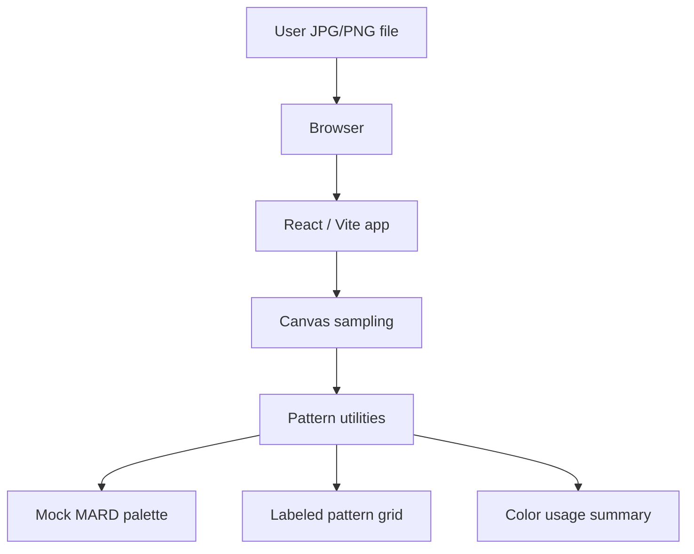

# Fundbeads Architecture

Fundbeads is a single-page, client-only web application. It converts a user-selected JPG or PNG into a Perler Bead / Fuse Bead pattern inside the browser.

## Runtime Boundary



There is no backend service. The production Docker image serves static files with nginx.

## Current Stack

- Vite
- React
- TypeScript
- Tailwind CSS v4
- pnpm workspace
- `@google/design.md` for linting and generating design theme variables
- nginx for static Docker runtime

## Source-of-Truth Map

- `frontend/src/App.tsx`: Single-page workflow, upload controls, resolution selector, grid rendering, and summary rendering.
- `frontend/src/pattern.ts`: `GridSize`, `Pattern`, `PatternCell`, `ColorUsage`, image sampling, RGB matching, readable text color, and count summaries.
- `frontend/src/palette.ts`: Current hardcoded mock MARD palette subset.
- `frontend/src/styles.css`: Tailwind v4 semantic token mapping.
- `frontend/src/design-theme.generated.css`: Generated CSS variables from `DESIGN.md`. Do not edit directly.
- `scripts/generate-design-theme.mjs`: Design token generation script.
- `docs/pattern-processing.md`: Pattern-processing contract.
- `docs/design-rules.md`: UI and grid design contract.
- `docs/runtime-and-deployment.md`: Build and static deployment contract.

## Data Flow

1. The browser receives a local `File` from the file input.
2. `createImageBitmap` decodes the image in the browser.
3. A square canvas draws the image at the selected grid size: `52`, `64`, or `78`.
4. Pixel data is read from the canvas.
5. Transparent pixels are composited against white.
6. Each sampled RGB value is matched to the nearest mock MARD palette entry by squared RGB Euclidean distance.
7. Pattern cells are produced in row-major order with 1-based `x` and `y` coordinates.
8. Usage counts are derived from the generated cells.
9. React renders the grid and summary.

## Contracts

- Supported grid sizes are `52`, `64`, and `78`.
- `BeadColor.code` is the stable color identity.
- `BeadColor.label` is display copy.
- `PatternCell.x` and `PatternCell.y` are 1-based.
- `Pattern.totalBeads` equals `Pattern.cells.length`.
- For complete generated patterns, `Pattern.totalBeads` equals `size * size`.
- `ColorUsage.count` is derived from pattern cells, never from formatted UI text.

## Boundaries

- Uploaded images must not leave the browser.
- The app must not add a backend, database, image upload service, or remote image processor without an explicit product decision.
- Palette data is currently a mock subset, not a verified full 221-color MARD dataset.
- Export and print flows are backlog items, not current runtime surfaces.

## Verification Commands

```sh
pnpm design:generate
pnpm check
```
